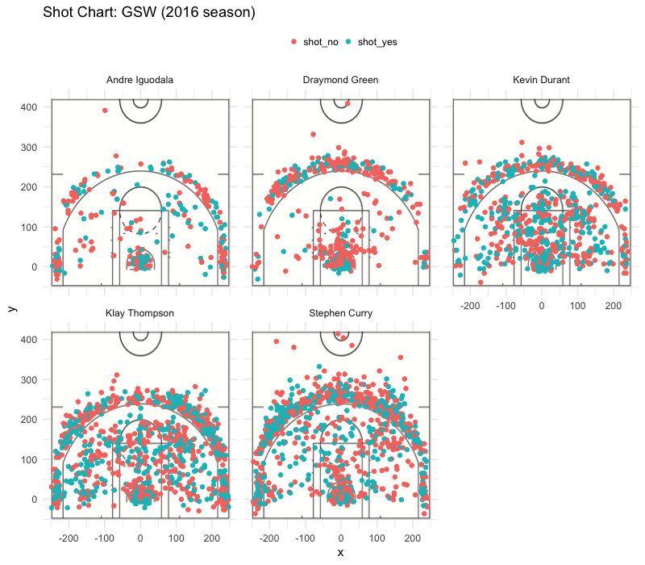

Workout 1
================
Natasha Yuanto Susetyo

The Death Lineup
================

Every time a player steps into the court, it's a new challenge; for the team and for them individually. They all strive to achieve one goal - to enjoy the glory of winning. Everyone who plays basketball knows it is more than just a mere sport, a hobby or even a passion that people have. And, yes! Some people even spend a fortune just to watch their favorite team and its players bleed and sweat during the game.

Over the years, one among the 30 NBA teams has particularly caught people's attention – the Golden State Warriors. They have emerged as the league’s best team over the past couple of years, and have even won NBA Championships. In particular, behind all these winnings, stands smaller group called "The Death Lineup." Developed under GSW's head coach Steve Kerr, it began during their 2014–2015 run that led to an NBA championship. The lineup features Andre Iguodala, Draymond Green, Kevin Durant, Klay Thompson, and Stephen Curry. Their profiles are listed as below.

### Profile

##### Andre Iguodala

| Personal Information |                                |
|----------------------|--------------------------------|
| Born                 | January 28, 1984 (age 35)      |
| From                 | Arizona                        |
| Nationality          | American                       |
| Listed height        | 6 ft 6 in (1.98 m)             |
| Listed weight        | 215 lbs (97.5 kg)              |
| Position             | Shooting guard / Small forward |
| NBA Debut            | 2004                           |
| Number               | 9                              |

##### Draymond Green

| Personal Information |                        |
|----------------------|------------------------|
| Born                 | March 4, 1990 (age 29) |
| From                 | Michigan State         |
| Nationality          | American               |
| Listed height        | 6 ft 7 in (2.01 m)     |
| Listed weight        | 230 lb (104.3 kg)      |
| Position             | Power forward          |
| NBA Debut            | 2012                   |
| Number               | 23                     |

##### Kevin Durant

| Personal Information |                             |
|----------------------|-----------------------------|
| Born                 | September 29, 1988 (age 30) |
| From                 | Texas                       |
| Nationality          | American                    |
| Listed height        | 6 ft 9 in (2.06 m)          |
| Listed weight        | 240 lb (108.9 kg)           |
| Position             | Small forward               |
| NBA Debut            | 2007                        |
| Number               | 35                          |

##### Klay Thompson

| Personal Information |                           |
|----------------------|---------------------------|
| Born                 | February 8, 1990 (age 29) |
| From                 | Washington State          |
| Nationality          | American                  |
| Listed height        | 6 ft 7 in (2.01 m)        |
| Listed weight        | 215 lb (97.5 kg)          |
| Position             | Shooting guard            |
| NBA Debut            | 2011                      |
| Number               | 11                        |

##### Stephen Curry

| Personal Information |                         |
|----------------------|-------------------------|
| Born                 | March 14, 1988 (age 30) |
| From                 | Davidson                |
| Nationality          | American                |
| Listed height        | 6 ft 3 in (1.91 m)      |
| Listed weight        | 190 lb (86.2 kg)        |
| Position             | Point Guard             |
| NBA Debut            | 2009                    |
| Number               | 30                      |

### Shot Charts

Below are shot charts for each players.

First and foremost, we have *Andre Iguodala*'s shot chart at the top left corner. He is known as an NBA All-Star in 2012 and NBA All-Defensie Team twice. Based on the chart, he seems to prefer taking shots from the three-point area than from the two-point area. He has an equally distribution of red and blue spots all over the court which indicates that he has a fair share of good and bad shots.

To the right, we have *Draymond Green*'s shot chart. He is known as a three-time NBA champion and a three-time NBA All-Star. Looking at his shot chart, he seems to be equally likely in taking shots from the three-point area or from the two-point area. Though, he appear to have quite an amount of bad shots. Despite it, he has proven himselft to be an excellent defender for the Warriors as he won the NBA Defensive Player of the Year title in 2017.

At the top right corner, we have *Kevin Durant*'s shot chart. Based on his chart, he certainly prefers to do shots in the two-point area as it is the most densely populated area. He has won numerous awards - from NBA Most Valuable Player Awards, to Olympic gold medals. He is also known as one of the highest-earning basketball players off the court in the world.

Credited as one of the greatest shooters in NBA history, we have *Klay Thompson*'s shot chart in the bottom left corner. He is a five-time NBA All-Star, a two-time All-NBA Third Team honoree, and a three-time NBA champion. Based on his chart, he seems to do a lot of shots both in the three-point area and the two-point area, making him nicknamed as the "Splash Brothers."

Last but not least, as many players and analysts have called him the greatest shooter in NBA history, we have *Stephen Curry*'s shot chart at the bottom center. He is known to be a six-time NBA All-Star,the NBA Most Valuable Player (MVP) twice and has won three NBA championships with the Warriors. Also, he is the other brother in the "Splash Brothers", rewriting history with his three-point shots. However, comparing his chart to Klay Thompson's, he seems to ba a risk taker instead as some of his shots are way further than the three-point line.

### Effective Shooting Percentage

For a more exact numberings, below are the tables of each player's shot.

##### 2PT Effective Shooting % by Player

                name total made perc_made
    1 Andre Iguodala   210  134  63.80952
    2   Kevin Durant   643  390  60.65319
    3  Stephen Curry   563  304  53.99645
    4  Klay Thompson   640  329  51.40625
    5 Draymond Green   346  171  49.42197

For two pointers, *Andre Iguodala* takes the lead with the highest shooting percentage. As a shooting guard, and small forward, he took the least shots compared to his fellow teammates, yet he has a success rate of 63.8%. On the other hand, we have *Kevin Durant* who took the most two-point shots. Among his 643 shots, about 60.7% of his shots were successful. Lastly, *Draymond Green* has the lowest success rate of shooting a two-pointer at 49.4%.

##### 3PT Effective Shooting % by Player

                name total made perc_made
    1  Klay Thompson   580  246  42.41379
    2  Stephen Curry   687  280  40.75691
    3   Kevin Durant   272  105  38.60294
    4 Andre Iguodala   161   58  36.02484
    5 Draymond Green   232   74  31.89655

From the table above, it is obvious that the “Splash Brothers” lived for their nickname. Both *Klay Thompson* and *Stephen Curry* boasts a 42.4% and 40.8% success rate, respectively. Both of them seems to also take the most three-point shots compared to the other three players. Notice that *Andre Iguodala* took the least shots from the three-point area, with only a success rate of 36.0%. Meanwhile, *Draymond Green* has the least success rate with only 31.9%.

##### Effective Shooting % by Player

                name total made perc_made
    1   Kevin Durant   915  495  54.09836
    2 Andre Iguodala   371  192  51.75202
    3  Klay Thompson  1220  575  47.13115
    4  Stephen Curry  1250  584  46.72000
    5 Draymond Green   578  245  42.38754

Overall, with their data all combined, we can see that *Kevin Durant* has the highest success rate in shooting. Despite not shooting the most amount of shots, he boast a 54.1% success rate. This tells us that more than half of his shots are successful, outperforming the other players overall. Moreover, we can see that *Klay Thompson* and *Stephen Curry* took the most shots with 47.1% and 46.7% success rate, respectively. With this information, we can say that doing a three-point shot is more risky than doing a two-point shot. Lastly, *Draymond Green*’s performance is quite pitiful compared to the rest. He has the lowest percentage of success rate at 42.4%.

### Conclusion

Altogether, the Golden State Warriors did well in the NBA 2016 season. All the five players performed outstandingly and proved that they are worth the nickname. Andre Iguodala, Draymond Green, Kevin Durant, Klay Thompson, and Stephen Curry - The Death Lineup- all have skills that are beyond words and only numbers can prove it. Hence, all these players are the pride of the Bay Area.
